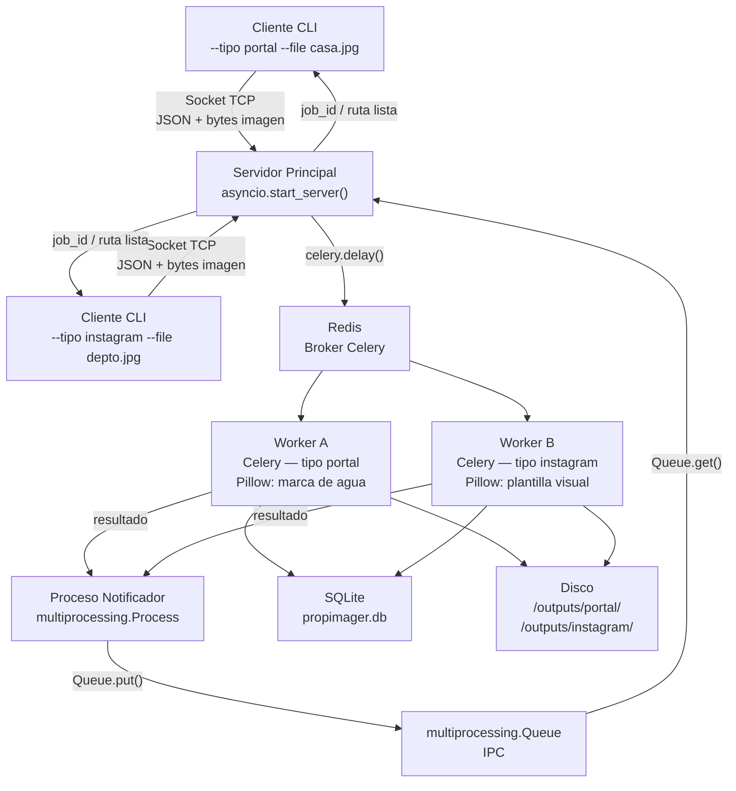
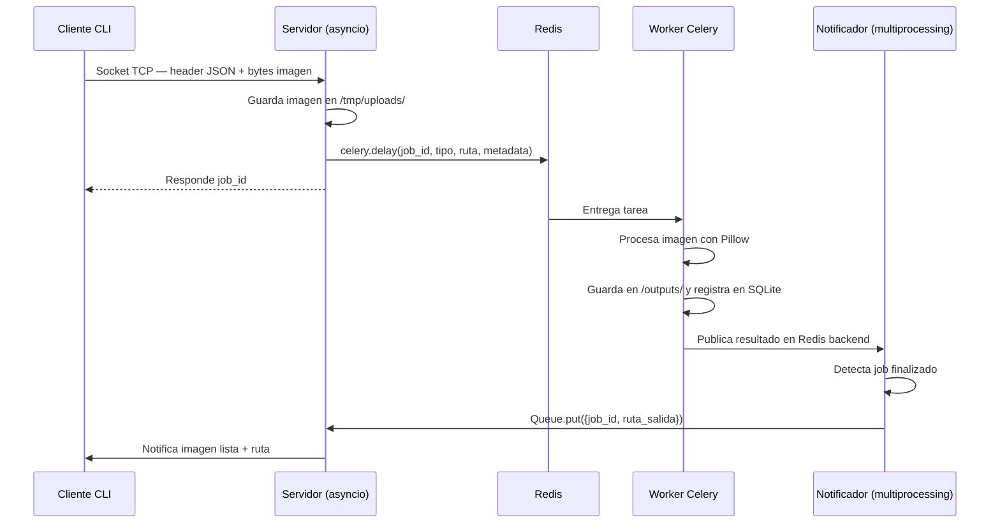

# Arquitectura del Sistema

## Diagrama general

## Diagrama de secuencia

## Nodos y mecanismos de IPC

| Nodo | Tecnología | Rol |
|---|---|---|
| Cliente CLI | `socket`, `argparse` | Envía imagen y metadata |
| Servidor principal | `asyncio` | Acepta N clientes concurrentes, encola tareas |
| Redis | Redis | Broker de tareas Celery |
| Workers | `Celery`, `Pillow` | Procesan imágenes en paralelo |
| Proceso Notificador | `multiprocessing.Process` | Detecta resultados y los pasa por IPC |
| `multiprocessing.Queue` | IPC | Comunicación notificador → servidor |
| Base de datos | SQLite | Persistencia de jobs y metadata |