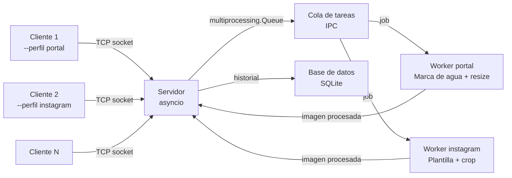

# Arquitectura del sistema

## Diagrama 


## Componentes y conectividad

```
[Cliente 1] ──┐
[Cliente 2] ──┤── TCP socket ──→ [Servidor asyncio] ──→ [Queue IPC] ──→ [Worker portal]
[Cliente N] ──┘                         ↑                               [Worker instagram]
                                        └─────── imagen procesada ───────────┘
                                        ↓
                                  [Base de datos SQLite]
```

## Mecanismos utilizados

| Mecanismo       | Dónde se usa                 | Por qué                                      |
| --------------- | ---------------------------- | -------------------------------------------- |
| asyncio         | Servidor: manejo de clientes | I/O bound, escala sin overhead de threads    |
| multiprocessing | Workers de procesamiento     | CPU bound, necesita paralelismo real         |
| Queue (IPC)     | Servidor → Workers           | Desacopla recepción de procesamiento         |
| TCP Sockets     | Cliente ↔ Servidor           | Comunicación confiable, orientada a conexión |
| SQLite          | Servidor → DB                | Historial liviano, sin dependencias extras   |
