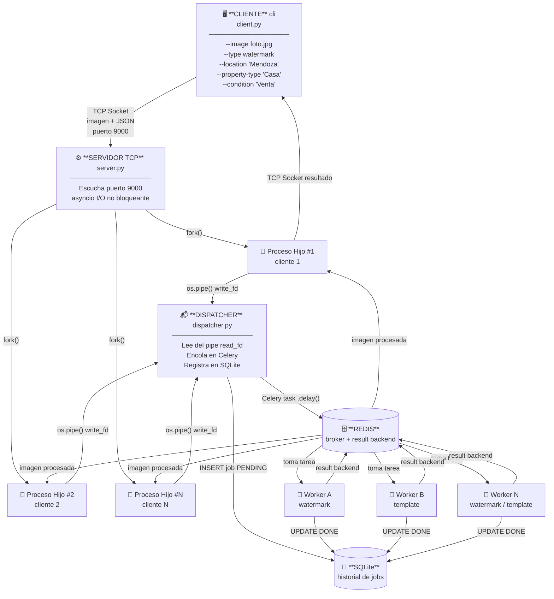
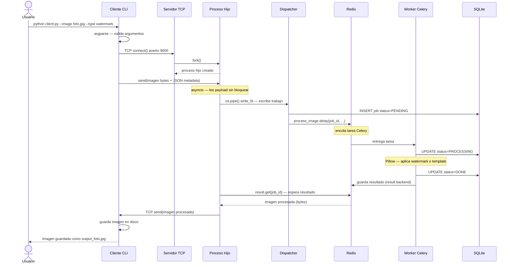
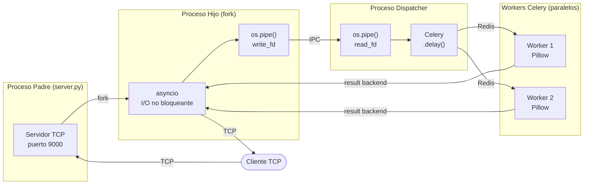

# Arquitectura del Sistema — RealtyEdit

## Diagrama de Nodos y Conectividad

---

## Flujo de una Solicitud (Sequence Diagram)

---

## Mecanismos de IPC — Vista Simplificada

---

## Mecanismos Concurrentes y de Sincronización

| Mecanismo | Dónde se usa | Por qué |
|-----------|-------------|---------|
| `fork()` | Servidor por cada cliente | Manejo concurrente de múltiples clientes de forma aislada |
| `os.pipe()` | Proceso hijo → Dispatcher | IPC unidireccional para pasar el trabajo entre procesos |
| `asyncio` | Proceso hijo al leer del socket | I/O asíncrono para no bloquear esperando el payload |
| `Celery + Redis` | Dispatcher → Workers | Cola de tareas distribuida para paralelismo en el procesamiento |
| `Redis result backend` | Workers → Proceso hijo | Notificación del resultado procesado |
| `argparse` | Cliente CLI | Parseo y validación de argumentos de línea de comandos |